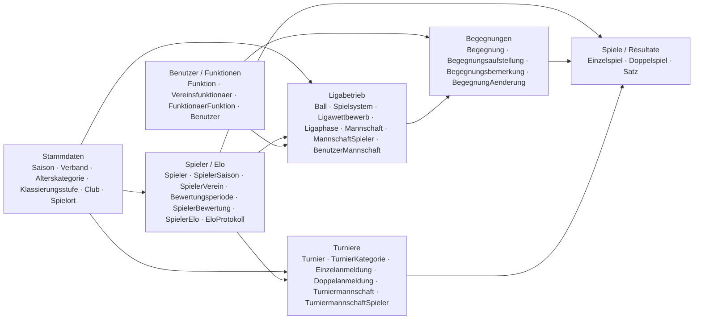
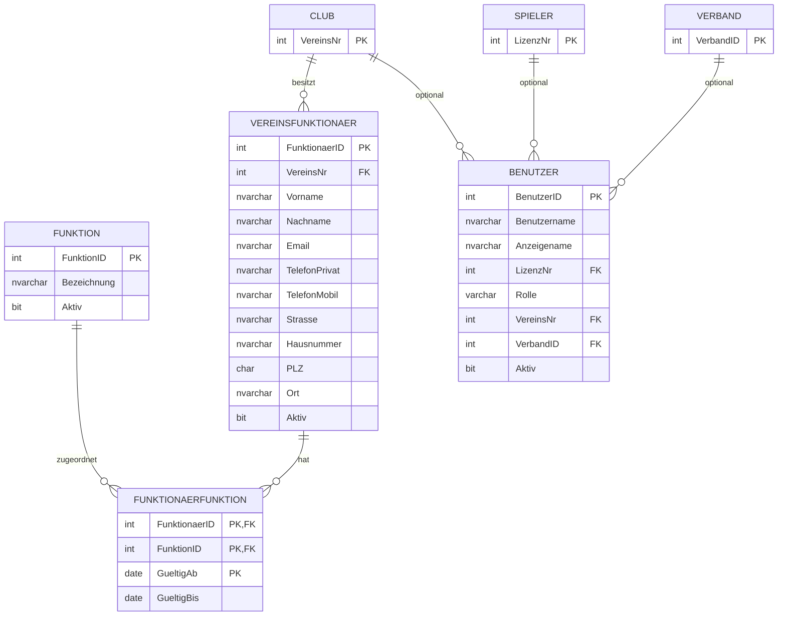
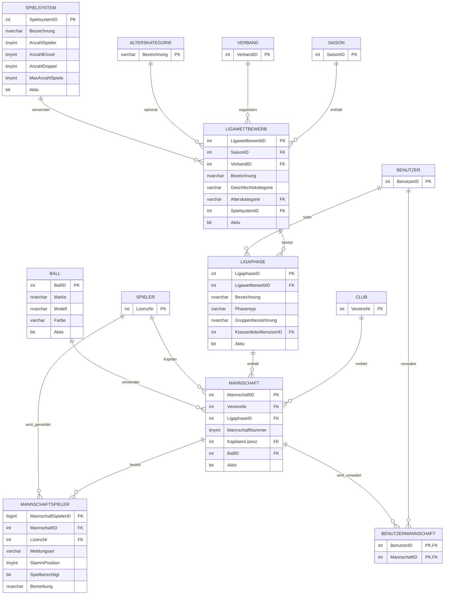
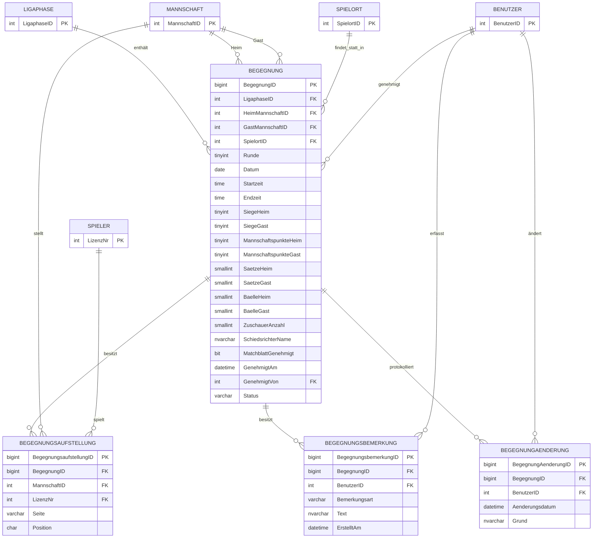
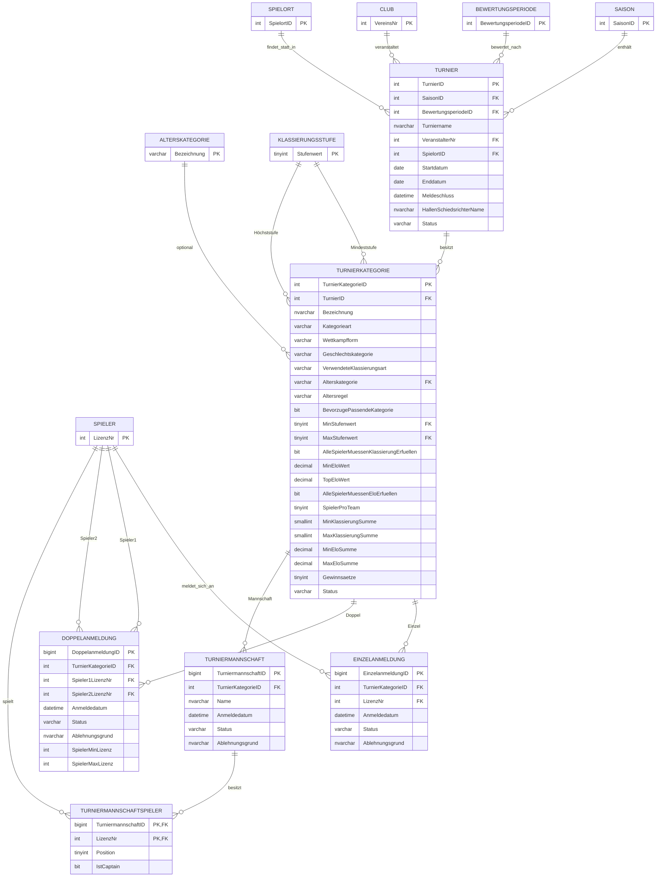
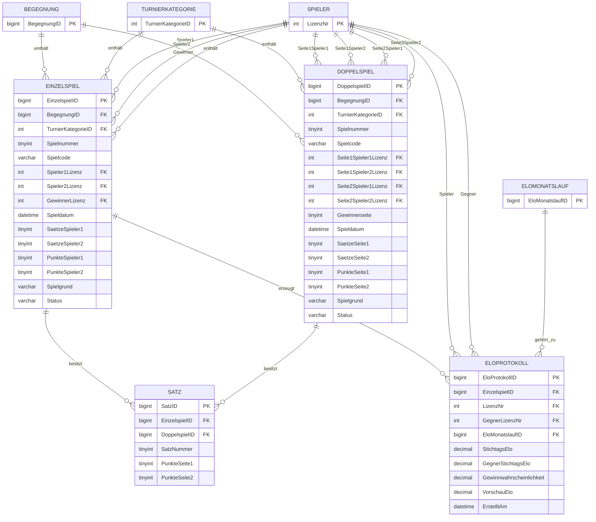

# ER-Diagramm

## 1. Zweck

Dieses Dokument visualisiert das relationale Datenmodell der STT-Datenbank.

Da das finale Schema 39 Tabellen umfasst, werden mehrere fachlich gegliederte Mermaid-Diagramme verwendet. Die Diagramme orientieren sich am tatsächlich implementierten SQL-Schema.

Die vollständigen Detailbeschreibungen befinden sich zusätzlich in:

- `Datenmodell.md`
- `Constraints.md`
- `Geschaeftsregeln.md`

---

## 2. Fachübersicht



---

## 3. Gesamtmodell

### 3.1 Stammdaten, Spieler und Elo

```mermaid
erDiagram

    SAISON {
        int SaisonID PK
        nvarchar Bezeichnung
        date Startdatum
        date Enddatum
        bit IstAktuell
    }

    VERBAND {
        int VerbandID PK
        varchar Kurzname
        nvarchar Name
        varchar Verbandstyp
        int UebergeordneterVerbandID FK
        date Gruendungsdatum
        nvarchar Webseite
        bit Aktiv
    }

    ALTERSKATEGORIE {
        varchar Bezeichnung PK
        tinyint MinAlter
        tinyint MaxAlter
    }

    KLASSIERUNGSSTUFE {
        tinyint Stufenwert PK
        varchar Bezeichnung
    }

    CLUB {
        int VereinsNr PK
        nvarchar Clubname
        nvarchar Kurzname
        int RegionalverbandID FK
        smallint Gruendungsjahr
        nvarchar Webseite
        nvarchar Ort
        char Landcode
        bit Aktiv
    }

    SPIELORT {
        int SpielortID PK
        int VereinsNr FK
        nvarchar Bezeichnung
        nvarchar Gebaeude
        nvarchar Strasse
        nvarchar Hausnummer
        char PLZ
        nvarchar Ort
        char Landcode
        bit IstHauptspielort
        bit Aktiv
    }

    SPIELER {
        int LizenzNr PK
        nvarchar Vorname
        nvarchar Nachname
        date Geburtsdatum
        char Geschlecht
        bit Aktiv
    }

    SPIELERSAISON {
        int LizenzNr PK,FK
        int SaisonID PK,FK
        varchar Alterskategorie FK
        bit LizenzAktiv
    }

    SPIELERVEREIN {
        bigint SpielerVereinID PK
        int LizenzNr FK
        int SaisonID FK
        int VereinsNr FK
        varchar Zuordnungsart
        varchar Wettbewerbsbereich
    }

    BEWERTUNGSPERIODE {
        int BewertungsperiodeID PK
        int SaisonID FK
        varchar Bezeichnung
        date Stichtag
        date GueltigAb
        date GueltigBis
    }

    KLASSIERUNGSGRENZE {
        int KlassierungsgrenzeID PK
        int BewertungsperiodeID FK
        tinyint Stufenwert FK
        varchar Klassierungsart
        decimal MinElo
        decimal MittelElo
        decimal MaxElo
    }

    SPIELERBEWERTUNG {
        bigint SpielerBewertungID PK
        int LizenzNr FK
        int BewertungsperiodeID FK
        decimal Elo
        tinyint HerrenStufenwert FK
        tinyint DamenStufenwert FK
        varchar Alterskategorie FK
        datetime ErstelltAm
    }

    ELOMONATSLAUF {
        bigint EloMonatslaufID PK
        date Berechnungsdatum
        date PeriodeVon
        date PeriodeBis
        varchar Status
        datetime GestartetAm
        datetime AbgeschlossenAm
        nvarchar Bemerkung
    }

    SPIELERELO {
        bigint SpielerEloID PK
        int LizenzNr FK
        bigint EloMonatslaufID FK
        decimal Elo
        decimal EloDeltaZumVormonat
        tinyint HerrenStufenwert FK
        tinyint DamenStufenwert FK
        int HerrenRang
        int Gesamtrang
        date GueltigAb
        date GueltigBis
    }

    ELOPROTOKOLL {
        bigint EloProtokollID PK
        bigint EinzelspielID FK
        int LizenzNr FK
        int GegnerLizenzNr FK
        bigint EloMonatslaufID FK
        decimal StichtagsElo
        decimal GegnerStichtagsElo
        decimal Gewinnwahrscheinlichkeit
        decimal VorschauElo
        datetime ErstelltAm
    }

    VERBAND ||--o{ VERBAND : "übergeordnet"
    VERBAND ||--o{ CLUB : "Regionalverband"
    CLUB ||--o{ SPIELORT : besitzt

    SPIELER ||--o{ SPIELERSAISON : hat
    SAISON ||--o{ SPIELERSAISON : umfasst
    ALTERSKATEGORIE ||--o{ SPIELERSAISON : klassifiziert

    SPIELER ||--o{ SPIELERVEREIN : hat
    SAISON ||--o{ SPIELERVEREIN : gilt_in
    CLUB ||--o{ SPIELERVEREIN : Verein

    SAISON ||--o{ BEWERTUNGSPERIODE : besitzt
    BEWERTUNGSPERIODE ||--o{ KLASSIERUNGSGRENZE : definiert
    KLASSIERUNGSSTUFE ||--o{ KLASSIERUNGSGRENZE : Stufe

    SPIELER ||--o{ SPIELERBEWERTUNG : erhält
    BEWERTUNGSPERIODE ||--o{ SPIELERBEWERTUNG : bewertet
    KLASSIERUNGSSTUFE ||--o{ SPIELERBEWERTUNG : Herrenstufe
    KLASSIERUNGSSTUFE ||--o{ SPIELERBEWERTUNG : Damenstufe
    ALTERSKATEGORIE ||--o{ SPIELERBEWERTUNG : Altersklasse

    SPIELER ||--o{ SPIELERELO : besitzt
    ELOMONATSLAUF ||--o{ SPIELERELO : erzeugt
    KLASSIERUNGSSTUFE ||--o{ SPIELERELO : Herrenstufe
    KLASSIERUNGSSTUFE ||--o{ SPIELERELO : Damenstufe

    SPIELER ||--o{ ELOPROTOKOLL : Spieler
    SPIELER ||--o{ ELOPROTOKOLL : Gegner
    ELOMONATSLAUF ||--o{ ELOPROTOKOLL : gehört_zu
```



---

### 3.2 Benutzer und Vereinsfunktionen



---

### 3.3 Ligabetrieb und Mannschaften



---

### 3.4 Begegnungen



---

### 3.5 Turniere und Anmeldungen



---

### 3.6 Einzelspiele, Doppelspiele, Sätze und Elo-Protokoll



---

## 4. Zentrale Beziehungen

### Spieler und Saison

```text
Saison
  |
  +-- SpielerSaison -- Spieler
  |
  +-- SpielerVerein -- Club
```

### Klassierung und Elo

```text
Saison
  |
  +-- Bewertungsperiode
          |
          +-- Klassierungsgrenze
          |
          +-- SpielerBewertung

EloMonatslauf
  |
  +-- SpielerElo
  |
  +-- EloProtokoll -- Einzelspiel
```

### Liga

```text
Saison
  |
  +-- Ligawettbewerb
          |
          +-- Ligaphase
                  |
                  +-- Mannschaft
                  |      |
                  |      +-- MannschaftSpieler
                  |
                  +-- Begegnung
                         |
                         +-- Begegnungsaufstellung
                         +-- Einzelspiel
                         +-- Doppelspiel
```

### Turnier

```text
Turnier
  |
  +-- TurnierKategorie
          |
          +-- Einzelanmeldung
          +-- Doppelanmeldung
          +-- Turniermannschaft
          |      |
          |      +-- TurniermannschaftSpieler
          |
          +-- Einzelspiel
          +-- Doppelspiel
```

### Resultate

```text
Einzelspiel ----+
                +---- Satz
Doppelspiel ----+

Einzelspiel ---- EloProtokoll
```

Nur Einzelspiele können Elo-Protokolle erzeugen.

---

## 5. Modellierungsentscheidungen

### Saisonabhängige Daten

Spieler-Stammdaten werden nicht pro Saison dupliziert. Saisonabhängige Informationen liegen in `SpielerSaison` und `SpielerVerein`.

### Historisierung

Offizielle Bewertungen und monatliche Elo-Werte werden nicht überschrieben, sondern über Bewertungsperioden und Monatsläufe historisiert.

### Liga und Turnier teilen Resultattabellen

`Einzelspiel` und `Doppelspiel` können entweder einer `Begegnung` oder einer `TurnierKategorie` zugeordnet sein.

### Gemeinsame Satztabelle

Die Tabelle `Satz` wird sowohl für Einzel- als auch Doppelspiele verwendet.

### Flexible Turnierstruktur

`TurnierKategorie` unterstützt unterschiedliche Wettkampfformen und Einschränkungen über Alter, Klassierung, Elo und Geschlecht.

### Nachvollziehbare Elo-Berechnung

`EloProtokoll` verbindet ein Elo-relevantes Einzelspiel mit Spieler, Gegner und Monatslauf.

---

## 6. Lesbarkeit des Gesamtmodells

Eine einzige Darstellung aller 39 Tabellen mit sämtlichen Attributen wäre nur schwer lesbar.

Deshalb ist das Gesamtmodell in folgende Fachbereiche aufgeteilt:

1. Stammdaten, Spieler und Elo
2. Benutzer und Vereinsfunktionen
3. Ligabetrieb und Mannschaften
4. Begegnungen
5. Turniere und Anmeldungen
6. Spiele, Resultate und Elo-Protokoll

Zusammen bilden diese Teilmodelle das vollständige relationale Schema.

Für Detailinformationen siehe:

- `Datenmodell.md`
- `Constraints.md`
- `Geschaeftsregeln.md`
